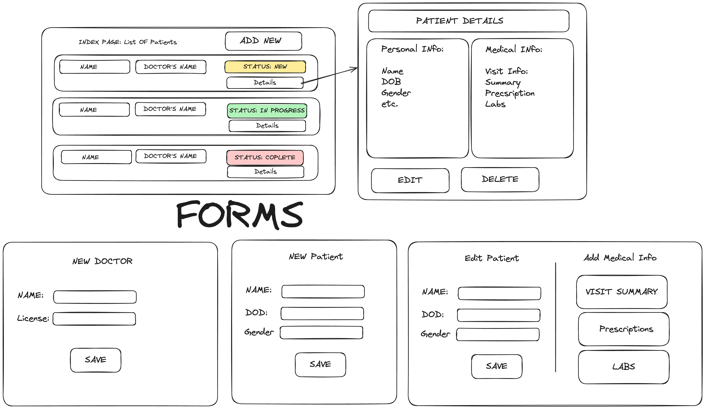
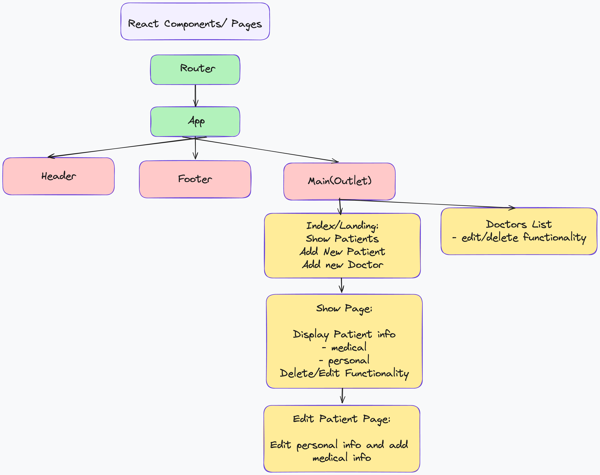

# Seal project 4

# Product Requirements Documentation

- **Developer: Yuliya Buiko**
- **App Name: Hospital Management System**
- **Description: Full-stack web application to handle a hospital’s work. The system should have an interface for creating doctors' accounts, inserting and updating patients and adding records for all patients’ details, and it should also offer a method for quickly accessing and searching records.**
- **GitHub Url Back End:https://github.com/uliaarkadz/BE_PROJECT4.git**
- **GitHub Url Front End:https://github.com/uliaarkadz/FE_PROJECT4.git**
- **Deployed WebSite FE:**
- **Deployed WebSite BE:**

## User Stories

- Users should be able to see the site on desktop and mobile
- Users can create a new doctor
- Users can create a new patient
- Users can see a list of all the patents
- Users can assign doctors and change patient statuses
- Users can update patient
- Users can delete patient
- Users can add patient visit information

## Design mockups (Desktop + Mobile)

## React Routers

